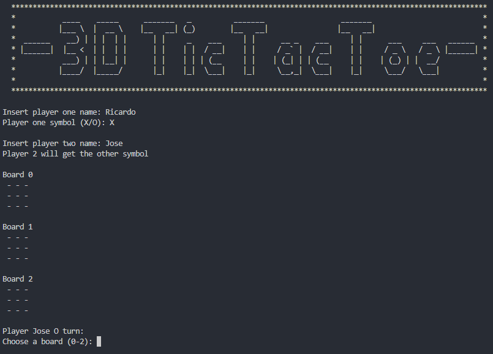

# # 3D Tic-Tac-Toe

## example

## Object Oriented Programin concepts
    *Abstraction: to model real life objects into a virtual enviroment.
    *Classes: Virtual model, works with attributes (characteristics) and methods (Behavior).
    *Objects: instances of classes.
    *Aggregation: Relation between classes.
    *Composition: Relation between classes, stronger kind of relation than aggregation.

## Design
The design or structure of this program was based on the scheme presented, where the main class is Game, which contains 2 players and 1 CubeBoard, the latter consists of three board, that are representad as a 3x3 matrix, where the player has a symbol and name, wich are used in the Game Main method, at first execution, the player might insert their names and player one will choose a symbol (X/O) and player two will be asigned the other one, this to avoid excesive info input, then the three board are presentad as three 3x3 matriz filled (by default) with "-", made to represent an empty space, then it will ask por the player with the "O" symbol to choose among the three boards (0-2) and to choose the row (0-2) and column (0-2) where his mark will be placed and thern it will ask for the player whith the symbol "X" to do the same, a winner is drawn by cheking if the elements of the board form a line, within a single board, or across boards. The implementation of this winner system was made in the CubeBoard class, cause its the class where we have easy access to the board class and its indexes.